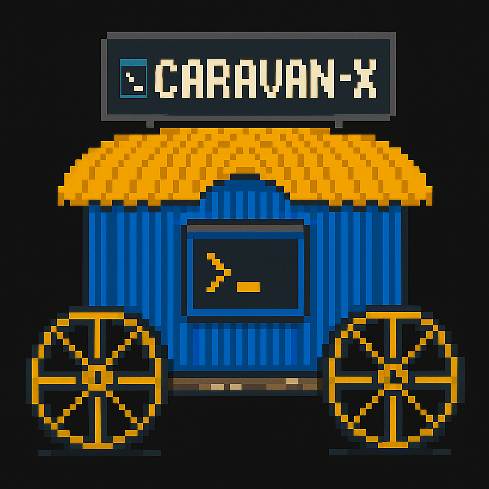

# Caravan-X

> A terminal-based development toolkit for Bitcoin developers who are tired of the "it works on my machine" problem.

Caravan-X creates reproducible Bitcoin regtest environments, manages Caravan-compatible multisig wallets, and lets you share exact blockchain states with your team — all from a beautiful terminal interface.



---

### 🎬 Video Tutorial

> [Watch the full demo: Caravan-X with Caravan Coordinator](https://drive.google.com/file/d/1AMB_MrrsPz8UXJzlDaIeZdcf38sbBRFW/view?usp=sharing)

---

## Table of Contents

- [What is Caravan?](#what-is-caravan)
- [What is Caravan-X?](#what-is-caravan-x)
- [Why Caravan-X Exists](#why-caravan-x-exists)
- [Architecture Overview](#architecture-overview)
- [Key Concepts](#key-concepts)
- [Installation](#installation)
- [Quick Start](#quick-start)
- [Modes of Operation](#modes-of-operation)
- [Documentation](#documentation)
- [CLI Reference](#cli-reference)
- [Configuration](#configuration)
- [Roadmap](#roadmap)
- [Troubleshooting](#troubleshooting)
- [Contributing](#contributing)
- [License](#license)

---

## What is Caravan?

[Caravan](https://github.com/caravan-bitcoin/caravan) is a free, open-source Bitcoin ecosystem monorepo maintained by Unchained Capital. It provides tools for creating and managing multisig Bitcoin wallets — including a web-based coordinator for building transactions, collecting signatures from multiple hardware wallets, and broadcasting to the Bitcoin network.

Caravan is powerful, but setting up a local development environment to test against it is complex. You need to manually install Bitcoin Core, configure a regtest network, set up nginx proxies for CORS, create descriptor wallets with the right format, and ensure every team member has an identical blockchain state. That's where Caravan-X comes in.


## What is Caravan-X

Caravan-X is the **developer tooling layer** that sits underneath Caravan. Think of it as the "backend setup script" that handles everything Caravan needs to function in a development/testing context:

- **One-command regtest environments** — Docker spins up Bitcoin Core, nginx, and everything pre-configured
- **Caravan-compatible wallets** — Generates `sortedmulti` descriptors with proper fingerprints and derivation paths that Caravan expects
- **Shareable blockchain states** — Package your entire regtest environment (blockchain data, wallets, keys, transaction history) into a `.caravan-env` archive and hand it to a teammate
- **Pre-built test scenarios** — RBF, CPFP, multisig signing flows, privacy analysis — all ready to run
- **Scripting engine** — Automate complex Bitcoin scenarios with JavaScript or JSON scripts
- **Profile isolation** — Run multiple independent regtest environments simultaneously with Docker

### Where Caravan-X Fits


## Why Caravan-X Exists

If you've ever tried to test Bitcoin multisig workflows, you know the pain:

1. **Setup hell** — Installing Bitcoin Core, writing `bitcoin.conf`, configuring RPC auth, setting up CORS proxies, generating initial blocks, creating descriptor wallets with the exact right format...
2. **"Works on my machine"** — Your teammate's regtest has different wallets, different block heights, different UTXOs. Bug reproductions become impossible.
3. **Descriptor nightmares** — Caravan expects `sortedmulti` descriptors with `[fingerprint/48'/1'/0'/2']xpub/0/*` format. One wrong character and nothing works.
4. **No reproducibility** — You spend 30 minutes setting up the perfect test state, then need to recreate it from scratch the next day.

Caravan-X eliminates all of this. One command, and you have a fully configured regtest environment that's identical every time and shareable with anyone on your team.

---
## Architecture Overview

### Project Structure
```
src/
├── cli.ts                  # CLI entry point (Commander.js commands)
├── index.ts                # Main application class (CaravanRegtestManager)
├── commands/               # User-facing command handlers
│   ├── wallet.ts           # Bitcoin wallet operations
│   ├── multisig.ts         # Caravan multisig wallet management
│   ├── transaction.ts      # PSBT creation, signing, broadcasting
│   ├── docker.ts           # Docker container management
│   ├── snapshot.ts         # Blockchain state save/restore
│   ├── scenario.ts         # Pre-built test scenario execution
│   ├── environment.ts      # Environment export/import (.caravan-env)
│   ├── settings.ts         # Configuration and profile management
│   └── system.ts           # Mining, system info, data export/import
├── core/                   # Business logic and service layer
│   ├── rpc.ts              # Bitcoin Core RPC client
│   ├── bitcoin.ts          # Bitcoin operations (wallet, address, tx)
│   ├── caravan.ts          # Caravan-specific wallet/descriptor logic
│   ├── docker.ts           # Docker container orchestration + nginx
│   ├── profiles.ts         # Profile isolation system
│   ├── snapshot.ts         # Snapshot create/restore/compare logic
│   ├── environment.ts      # .caravan-env archive export/import
│   └── transaction.ts      # Transaction building, PSBT handling
├── scripting/              # Automation engine
│   ├── ScriptEngine.ts     # JS + JSON script executor
│   ├── cli-integration.ts  # Script commands for TUI/CLI
│   ├── templates/          # Built-in scenario templates
│   └── README.md           # Scripting documentation
├── types/                  # TypeScript type definitions
│   ├── config.ts           # Configuration, profile, docker types
│   └── environment.ts      # Environment sharing types
├── ui/                     # Terminal UI components
│   ├── mainMenu.ts         # Interactive menu system
│   └── setupWizard.ts      # First-run configuration wizard
└── utils/                  # Shared utilities
    ├── errors.ts           # Centralized error handling + categorization
    ├── logger.ts           # Multi-level logging system
    └── terminal.ts         # Terminal formatting helpers
```

### How Data Flows

1. **User interacts** with the TUI (arrow keys + Enter) or CLI commands
2. **Command handlers** (`src/commands/`) validate input and orchestrate operations
3. **Core services** (`src/core/`) execute the actual logic (RPC calls, Docker commands, file operations)
4. **Bitcoin Core** receives RPC commands through the nginx proxy (Docker) or directly (Manual)
5. **Results** are formatted and displayed back to the user with progress indicators

### Service Layer Pattern


The command layer handles user-facing display, while the service layer uses `log.debug()` for internal tracing. Errors bubble up from services to commands, where they're transformed into user-friendly messages with specific troubleshooting suggestions.

---


## Key Concepts

### Profiles

Every Caravan-X configuration is a **profile** — an isolated directory containing everything for that specific setup:
```
~/.caravan-x/
└── profiles/
    ├── a1b2c3d4/                    # Docker Profile "My Test Setup"
    │   ├── config.json              # Profile-scoped configuration
    │   ├── docker-data/             # Bitcoin Core blockchain data
    │   │   ├── bitcoin-data/
    │   │   └── nginx/
    │   ├── wallets/                 # Caravan wallet JSON configs
    │   ├── keys/                    # Private key files
    │   ├── snapshots/               # Saved blockchain states
    │   ├── scenarios/               # Custom test scripts
    │   └── logs/                    # Profile-specific logs
    └── e5f6g7h8/                    # Docker Profile "Fee Bumping Tests"
        └── ... (completely isolated)
```

**Why profiles matter:**

- **No data leakage** — Wallets from Profile A never appear in Profile B's exports
- **Simultaneous Docker profiles** — Each gets its own container with unique ports
- **Manual mode limit** — Only one Manual profile is allowed (since all Manual profiles share the same `bitcoind` instance)
- **Switch instantly** — Change between profiles in Settings without losing anything

### Docker Mode vs Manual Mode

| Feature | Docker Mode | Manual Mode |
|---------|-------------|-------------|
| Bitcoin Core setup | Automatic | You manage it |
| nginx CORS proxy | Included | You configure it |
| Multiple profiles | Yes (each gets own container) | One profile max |
| Snapshots | Yes | Not available |
| Environment sharing | Full support | Limited |
| Port conflicts | Auto-resolved | Manual resolution |
| Caravan integration | Pre-configured | Manual CORS setup |

### Descriptors & Caravan Compatibility

Caravan-X generates descriptors in the exact format Caravan expects:
```
wsh(sortedmulti(2,[fingerprint1/48'/1'/0'/2']xpub1/0/*,[fingerprint2/48'/1'/0'/2']xpub2/0/*))
```

Key requirements that Caravan-X handles automatically:
- Uses `sortedmulti` instead of `multi` (Caravan requirement)
- Includes full derivation paths with fingerprints: `[abcd1234/48'/1'/0'/2']`
- Obtains checksums from Bitcoin Core via `getdescriptorinfo` before importing
- Creates both receive (`/0/*`) and change (`/1/*`) descriptors

---

## Installation

You'll need Node.js v22 or later. Then install globally via npm:
```bash
npm install -g caravan-x
```

That's it. Run `caravan-x` and you're off to the races.

### Install from source
```bash
git clone https://github.com/Legend101Zz/CaravanX.git
cd CaravanX
npm install
npm run build
npm link    # Makes 'caravan-x' available globally
```

### Verify installation
```bash
caravan-x --version
```

For development (if you want to contribute or modify):
```bash
git clone https://github.com/Legend101Zz/CaravanX.git
cd CaravanX
npm install
npm run build
npm link  # Makes caravan-x available globally
```

---
---

## Quick Start

### Docker Mode (Recommended)
```bash
caravan-x
```

1. Select **"Docker Mode (Recommended)"**
2. Accept defaults or customize RPC credentials, ports, container name
3. Name your profile (e.g., "My Dev Setup")
4. Wait ~30 seconds for Bitcoin Core + nginx to spin up
5. You now have a running regtest with 101 blocks and spendable coins

### Manual Mode
```bash
caravan-x
```

1. Select **"Manual Mode"**
2. Enter your Bitcoin Core RPC connection details (host, port, user, pass)
3. Point to your Bitcoin Core data directory
4. Start using wallet and transaction features immediately

> **Prerequisite for Manual Mode:** Bitcoin Core must already be running in regtest mode. See [Manual Mode Setup Guide](./docs/manual-mode.md).

---

## Modes of Operation

### Docker Mode

Docker mode is fully automated. When you create a Docker profile, Caravan-X:

1. Checks Docker is installed and running
2. Detects system architecture (handles ARM64/Apple Silicon with `--platform linux/amd64`)
3. Creates a Docker network (`caravan-x-network`)
4. Scans for port conflicts and auto-assigns alternatives if 18443/18444/8080 are busy
5. Generates `bitcoin.conf` with your RPC credentials
6. Starts the `bitcoin/bitcoin:27.0` container with proper volume mounts
7. Waits for Bitcoin Core to be ready (with retry logic)
8. Starts an nginx container with CORS headers for Caravan browser access
9. Creates a `mining_wallet` and generates 101 blocks (coins become spendable)
10. Creates a watch-only wallet for Caravan integration
11. Tests the full RPC connection chain

Your node is then accessible at `http://localhost:8080` (or whichever port was assigned).

### Manual Mode

For developers who want full control. You provide the RPC connection details and Caravan-X connects to your existing Bitcoin Core. You get all features except Docker management, snapshots, and environment sharing.

**Minimal `bitcoin.conf` for Manual Mode:**
```ini
# Global settings (must be at root level)
rpcuser=your_username
rpcpassword=your_password
server=1

# Regtest-specific settings (must be in [regtest] section)
[regtest]
rpcport=18443
rpcbind=0.0.0.0
rpcallowip=0.0.0.0/0
```

> ⚠️ Modern Bitcoin Core (v0.17+) requires network-specific settings like `rpcport` to be in the `[regtest]` section, while auth credentials remain global.

---

## Documentation

Detailed user guides live in the [`docs/`](./docs/) folder:

| Guide | Description |
|-------|-------------|
| [Getting Started](./docs/getting-started.md) | First-time setup walkthrough |
| [Docker Mode Guide](./docs/docker-mode.md) | Docker profiles, multiple environments, container management |
| [Manual Mode Guide](./docs/manual-mode.md) | Connecting to your own Bitcoin Core |
| [Basic Wallets](./docs/basic-wallets.md) | Creating, viewing, funding, and sending with basic wallets |
| [Caravan Multisig](./docs/caravan-multisig.md) | Creating multisig wallets, funding, spending, signing PSBTs |
| [Transactions](./docs/transactions.md) | PSBT creation, signing, finalizing, and broadcasting |
| [Environment Sharing](./docs/environment-sharing.md) | Exporting and importing `.caravan-env` archives |
| [Snapshots](./docs/snapshots.md) | Saving and restoring blockchain states |
| [Scripting Engine](./docs/scripting.md) | Automating scenarios with JS/JSON scripts |
| [Test Scenarios](./docs/test-scenarios.md) | Built-in RBF, CPFP, and multisig scenarios |
| [Visualization](./docs/visualization.md) | Blockchain activity visualization (Manual mode) |
| [Working with Caravan](./docs/caravan-integration.md) | Connecting Caravan-X to the Caravan web UI |
| [Profiles & Settings](./docs/profiles-settings.md) | Managing multiple configurations |
| [Troubleshooting](./docs/troubleshooting.md) | Common issues and solutions |

> 📹 Each guide includes video walkthroughs. Videos coming soon!

---
## CLI Reference

Every TUI feature is also available as a direct command — useful for scripting and CI/CD.

### Wallet Commands
```bash
caravan-x list-wallets                          # List all wallets
caravan-x create-wallet --name my_wallet        # Create a regular wallet
caravan-x create-wallet --name my_watch --watch-only  # Watch-only wallet
caravan-x fund-wallet --name my_wallet --blocks 10    # Mine blocks to fund
caravan-x send --from wallet_a --to wallet_b --amount 1.5
```

### Multisig Commands
```bash
caravan-x create-caravan          # Interactive multisig creation wizard
caravan-x list-caravan            # List all Caravan wallets
caravan-x sign-caravan-psbt --file transaction.psbt --key
caravan-x import-caravan --file wallet_config.json
```

### Transaction Commands
```bash
caravan-x create-psbt             # Create a new PSBT
caravan-x mine --blocks 6 --wallet my_wallet
```

### Script Commands
```bash
caravan-x run-script --file my_scenario.js
caravan-x run-script --file my_scenario.js --verbose
caravan-x run-script --file my_scenario.js --dry-run
caravan-x create-script --name "my_test" --type js
```

### Environment Commands
```bash
caravan-x env export --name "team-setup" --output ./team-setup.caravan-env
caravan-x env import ./team-setup.caravan-env
caravan-x env inspect ./team-setup.caravan-env
```

### System Commands
```bash
caravan-x system-info
caravan-x simulate --blocks 5 --transactions 3
```

---

## Configuration

Configuration is stored per-profile at `~/.caravan-x/profiles/<id>/config.json`:
```json
{
  "mode": "docker",
  "bitcoin": {
    "protocol": "http",
    "host": "localhost",
    "port": 8080,
    "user": "caravan_user",
    "pass": "caravan_pass",
    "dataDir": "~/.caravan-x/profiles/a1b2c3d4/docker-data/bitcoin-data"
  },
  "docker": {
    "enabled": true,
    "image": "bitcoin/bitcoin:27.0",
    "containerName": "caravan-x-bitcoin-a1b2c3d4",
    "ports": { "rpc": 18443, "p2p": 18444, "nginx": 8080 },
    "network": "caravan-x-network"
  },
  "snapshots": {
    "enabled": true,
    "directory": "~/.caravan-x/profiles/a1b2c3d4/snapshots",
    "autoSnapshot": false
  }
}
```

You can edit configuration through the TUI: **Settings → Edit Current Config**.

---

## Roadmap

### Phase 1: Core Testing Tool ✅

- [x] Docker mode with automated Bitcoin Core setup
- [x] Manual mode for existing installations
- [x] nginx proxy with CORS for Caravan integration
- [x] Pre-configured test scenarios (RBF, CPFP, Multisig)
- [x] Snapshot and restore for blockchain states
- [x] Caravan-compatible descriptors (`sortedmulti` with proper paths)
- [x] Privacy profile testing (good/moderate/bad wallets)
- [x] JavaScript and JSON scripting engine
- [x] Profile isolation system

### Phase 2: Terminal UI Improvements (In Progress)

- [x] Interactive setup wizard
- [x] Mode-specific menus
- [ ] Improved mempool.space-style visualization
- [ ] Better transaction flow diagrams
- [ ] Real-time UTXO updates

### Phase 3: Environment Sharing (In Progress)

- [x] Basic snapshot export
- [x] `.caravan-env` archive format for complete environments
- [x] One-command environment import into isolated profiles
- [ ] Version-controlled environment definitions

### Phase 4: AI Integration (Brainstorming)

- [ ] Natural language commands via LLM integration
- [ ] Support for OpenRouter, Claude, OpenAI, Ollama
- [ ] Generate scripts from descriptions
- [ ] Automated scenario creation

---

## Working with Caravan

Caravan-X is designed to work seamlessly with Caravan (the web-based multisig coordinator).

### Setting Up Caravan to Talk to Your Node

1. Start Caravan-X in Docker mode
2. In Caravan's settings, set the Bitcoin node URL to `http://localhost:8080`
3. Use the same RPC credentials you configured in Caravan-X

### Importing Multisig Wallets

When you create a multisig wallet in Caravan-X:

1. A configuration file is saved to `~/.caravan-x/wallets/`
2. In Caravan, go to Wallet > Import
3. Load the configuration JSON file
4. Caravan will recognize the descriptors and show your addresses

### Signing Transactions

1. Create a spending transaction in Caravan
2. Export the PSBT
3. In Caravan-X, go to Caravan Multisig > Sign Caravan PSBT
4. Sign with the appropriate key
5. The signature JSON is copied to clipboard
6. In Caravan, import the signature

---

## Troubleshooting

See the full [Troubleshooting Guide](./docs/troubleshooting.md). Common issues:

**Docker won't start:** Make sure Docker Desktop is running. Check `docker --version`.

**Port already in use:** Caravan-X auto-detects and reassigns ports. If it persists: `lsof -i :8080` to find what's using the port.

**Can't connect to Bitcoin Core (Manual):** Verify `bitcoind -regtest` is running, check RPC credentials match `bitcoin.conf`, ensure `server=1` is set.

**Caravan can't see wallets:** Use Docker mode (includes nginx CORS proxy), or manually configure CORS on your setup. Set Caravan's node URL to `http://localhost:8080`.

**Descriptors not importing:** Ensure you're using Bitcoin Core v0.17+ with descriptor wallets. Caravan-X uses `sortedmulti` format automatically.

---


## Contributing

Caravan-X is open source and contributions are welcome. Here's how to get involved:

1. Fork the repository
2. Create a feature branch
3. Make your changes
4. Run `npm run lint` and `npm test`
5. Submit a pull request

**Areas where help is appreciated:** test scenario templates, improved mempool visualization, documentation, bug fixes.

Report issues: [GitHub Issues](https://github.com/Legend101Zz/CaravanX/issues)


---

## License

MIT License - see LICENSE file for details.

---

Built with care for the Bitcoin development community by [Mrigesh Thakur](https://github.com/Legend101Zz).
